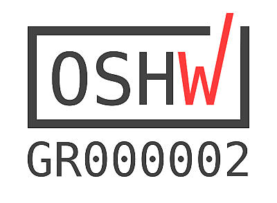

 **ESPresso Scale**  
Fully open source (s/w & h/w) scale project.
  
  
**Main repository of the project is on gitlab**  
https://gitlab.com/jousis/espresso-scale    
**Library only repository**
https://gitlab.com/jousis/ads1232-library  
  
  
**Demo videos**
- https://www.youtube.com/watch?v=8tvMJu86iec
- https://www.youtube.com/watch?v=bEaxTo1kfss
- https://www.youtube.com/watch?v=PEWwwGYqkho
- https://www.youtube.com/watch?v=CMC78F73UXM
- https://www.youtube.com/watch?v=utdwb62cblk
- https://www.youtube.com/watch?v=FwshqRFPCWY
- https://www.youtube.com/watch?v=zp7rjEApNao
- many more coming soon

**Features**
- Open source firmware, software and hardware
- Two pcb designs, one with LED segment display and one with SPI connector (for OLED/TFT)
- Ionic v4 "beta" application with live weight display and full control of scale options (BLE)
- ESP32 (wroom module) MCU
- ADS1232 24-bit ADC from TI
- Lipo and USB powered
- 10SPS and 80SPS sampling speed with various options regarding filtering/smoothing
- Auto calibration function (selectable weight)
- Touch buttons , using ESP32 pins or external touch module (TTP223).
- OTA upgrade mode (wifi)
- 3d printed case (stl & fusion360 files provided)
- power consumption from 50mA under full use (TFT) to <1mA while on deep sleep

**What is provided ?**
- PCB Gerber file
- PCB pictures
- PCB assembly guide
- PCB layer drawings (top/bottom)
- Schematics (PDF)
- PCB easyEDA project export
- Fusion 360 project file for the cases
- stl files for the cases
- Assembly guide (basic)
- Bill of materials (BOM)
- Pinout reference
- Firmware (Arduino IDE project)
- Mobile Application (Ionic v4 source code)
- Basic ADC settings explanation file and some basic tests

  

**Documentation**  
All the source files have a lot of comments inside but I will upload separate, more detailed documents, soon.

  

**Consider contributing**  
I am not a developher, nor an EE.  
This project is intended as a kick start for the community to build something awesome.  
Feel free to change anything in any way you see fit.  
If you want to read more technical stuff and reasons why I did what I did, check out this [hackaday page](https://hackaday.io/project/164256-espresso-scale).  
I will try to upload details about all aspects of the design.  

  
**License**  
  
Software under [GPL v3](https://gitlab.com/jousis/espresso-scale/blob/master/LICENSE)  
Hardware under [CERN Open Hardware Licence v1.2](https://gitlab.com/jousis/espresso-scale/blob/master/hw-LICENSE)  
Documentation under [CC BY-SA license 2.0](https://creativecommons.org/licenses/by-sa/2.0/)
